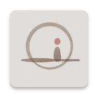

# Meditation

 

  
  <h3 align="center">颂静</h3>

# 👋 Background
This is our collaborative project developed by the Meditation Team, designed specifically for the UniqueStudio Winter Camp. Our app helps people meditate, focus on themselves, and unwind. We've already achieved its foundational functionality, and next we will continue to improve it.

# 📷 Screenshots

 

# ✨ Feature
- **Timer**: help you focus on yourself.
- **Background Music**: relax and immerse yourself in meditation.
- **Mood Record**: capture your post-meditation feelings. 
- **Multiple Themes**: select the background based on your current mood.

 
  

# 🚀 Tech
This project uses MVVM architecture and the style is Material Design Three.
* [Jetpack Compose](https://developer.android.com/jetpack/compose)
* [Navigation](https://developer.android.com/jetpack/compose/navigation)
* [Room](https://developer.android.com/training/data-storage/room)
* [ViewModel](https://developer.android.com/topic/libraries/architecture/viewmodel)
* [Coroutines](https://developer.android.com/kotlin/coroutines)

 

# ⚖️ Licence 

- **[GPL-3.0 license](LICENSE)**

 
